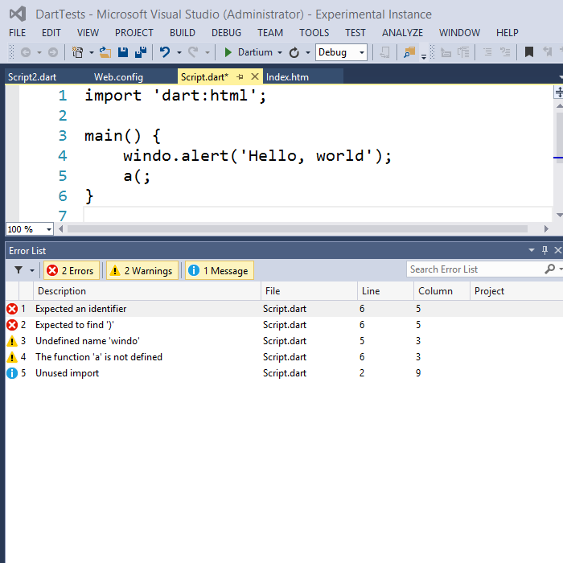

> NOTE: This software is not being actively developed or maintained, however a Dart integration for Visual Studio Code is which can be found [in the Visual Studio Marketplace](https://marketplace.visualstudio.com/items?itemName=DanTup.dart-code) and [on GitHub](https://github.com/Dart-Code/Dart-Code)

DartVS: Google Dart support for Visual Studio
=========

## IMPORTANT!
The current version of DartVS available to install (v0.6) in Visual Studio is very basic and uses regex for syntax highlighting,
and shells out to DartAnalyzer on a per-file basis for errors/warnings. This is not terribly reliable!

A new version of the extension (v0.8/v1) is in-progress which uses Google's Dart Analysis service and is much faster and more reliable, however it's not yet ready for release :(

- Live in v0.6
  - [x] Use DartAnalyzer from the SDK when saving any .dart file and report errors/warnings/hints to the Visual Studio error list
  - [x] Clicking errors navigates to the correct place in code
  - [x] Mostly-reliable Syntax Highlighting
- [In Development for v1](/../../issues?q=is%3Aissue+milestone%3A0.8)
- [Planned for after v1](/../../issues?q=is%3Aissue+milestone%3APost-1.0)

## Installation
- Install from the [Visual Studio Gallery](http://visualstudiogallery.msdn.microsoft.com/69112f14-62d0-40fb-9ccc-03e3534e7121)

## Using a custom SDK
If you wish to use a different version of the SDK than the one bundled with DartVS (for example, a dev channel build), you can:
- Download and unzip a [Dart SDK](https://www.dartlang.org/tools/sdk/)
- Set the DART_SDK environment variable to point at the SDK root

Feedback
===
Please send your feedback/issues/feature requests! :-)

- GitHub Issues: [DartVS/issues](https://github.com/DartVS/DartVS/issues)
- Twitter: [@DanTup](https://twitter.com/DanTup)
- Google+: [Danny Tuppeny](http://profile.dantup.com/)
- Email: [danny+dartvs@tuppeny.com](mailto:danny+dartvs@tuppeny.com)
